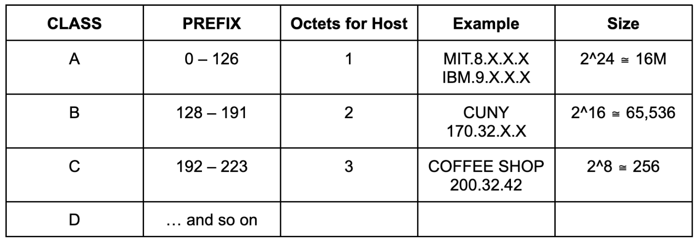
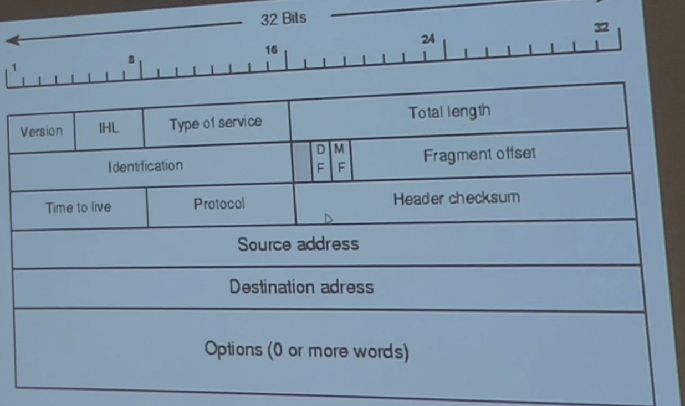

# Network Layer
- provides end to end delivery
- Limitation of MAC Addresses:
    - assigned at manufacture time, so they are not useful in representing if they are part of a network
    - IP Addresses solve this problem
        - Tells us if a device is part of a network
- Network: collection of computers in same cluster

## IPv4 Address Format
- 32-bit Format
- Typically represented as 4 octets (an octet is a unit of digital information consisting of eight bits often referred to as a byte)
- Example: 63.125.255.4
- 2^32 possible IP addresses

## Classful Addressing
- Hystorical System: No longer used today

IP Addresses were broken into 2 components
- 8.X.X.X
    1. Network Portion (8)
    2. Host Portion (X.X.X)
        - Identifies a unique device on that network

## CIDR: Classless InterDomain Routing (Modern)
CIDR Address (Network)
8.10.16.0/20
00001000.00001010.00010000.00000000
- Note: The  "/20" is called a subnet identifier

IP Address (Device Address):
8.10.31.63
00001000.00001010.00011111.00111111

The decimal representation is **meaningless**
- The way we determine if these devices are in the same network is to convert these values into binary and check the first 20 bits and see if they follow the same prefix

**EXAMPLE | EXAM**
8.10.31.63 →   **00001000.00001010.0001** | 1111.00111111
8.10.16.0/20 → **00001000.00001010.0001** | 0000.00000000
The first **20 bits** are the exact same, so they are from the same network

## Ip Header

- Represents the format of an IPv4 packet
- Used in networking to transmit data between devices over the internet
- 32 bits wide
- Version Field: Binary version indicator
    - Indicates the IP Version
- IHL: Internet Header Length
    - Specifies the length of the IP header
- Type of Service:
    - Largely not used
    - Indicates type of service
    - Used for quality of service and prioritization
- Total Length: 
    - Total Length of entire message, including header and data
    - Allows 16 bits of message length info

---
- Fragmentation Row:
    - Not Used
    - Identification
    - Fragment Offset
        - Indicates where in the original packet this fragment belongs

---
- Time to Live
    - Limites the packet's lifespan to prevent infinite loops between routers/devices
    - A misconfigured router or another issue can cause a message to be sent to the incorrect device, creating a routing loop
        - TTL helps prevent this as we don't have infinite bandwidth
- Protocol (8 bits):
    - Protocol that is used one layer above
    - Identifies the transport layer protocol (eg. TCP, UDP)
- Header Checksum
    - Largely unused
    - Used for error-checking the header
- Source Address:
    - The sender's IP address
- Destination Address:
    - The receiver's IP address

## Reserved IP Addresses
- Cannot be used by public networks
- If a router encounters one of these addresses, it will understand to never route out to it.
- **Loopback Range**
    - 127.0.0.0/8 
    - 127.0.0.1 (Localhost)
    - Network card will send the message back out to you as if you are just receiving the message
- **Local Network Range**
    - 192.168.0.0/16
    - 192.0.0.0/24
    - Mainly for like home devices such as printers
- **Multicast**
    - 224.0.0.0/4
    - Used for applications of 1-Many onesided data delivery
        - (CCTV Systems)

## ARP
Address Resolution Protocol (DLL Protocol)
- used to find out which device currently owns a specified IP Address

## DHCP
Dynamic Host Configuration Protocol
- Algorithm used to assign IP Addresses to devices
- Completely invisible to people using it
- As soon as you plug a device into an ethernet cable, an IP Address is automatically assigned to it
- Automatically assigns an IP Address to a newly connected device
- DHCP Router given a range its allowed to assign to newly connected devices
- Steps:
    1. Discover
        - New device broadcasts new discover request to request an IP
        - Broadcast message requesting an IP Address
    2. Offer
        - Hey device, you can have ...
        - Possible for the device to be offered multiple IP Addresses from different DHCP Routers. Device uses the one that comes first.
    3. Request: Request the IP of the first offer received
    4. ACK: "A" you have ... until 4/31/2025 (example)
- IP Addresses belong to the network + are leased out to devises on that network
- Has a drawback
    - Protocol that works extremely well for client based applications