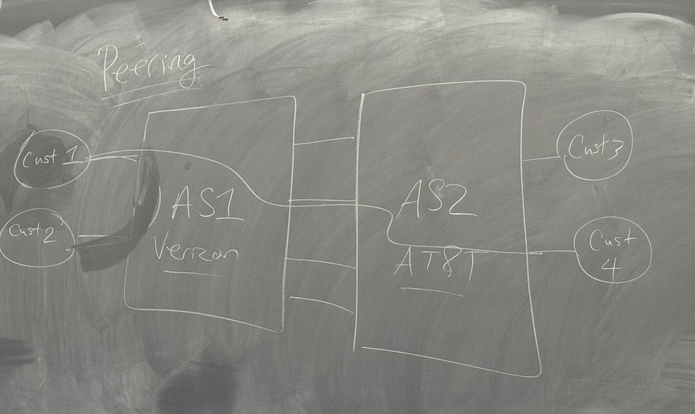

# Routing Algorithms
Fall into two categories (**Exterior vs Interior Gateway Protocols**)
- EGP
    - Routing algorithms used between 2+ A.S.
- IGP
    - Routing algorithms used inside a single A.S.
    - Prioritize speed

Definitions

Network Operator:
- Entity in charge of all traffic in and out of a network
Autonomous System (A.S):
    - A collection of networks administerred by the same network operator under a unified routing policy
    - Version, AT&T, etc.

## EGPs
Peering Relationship
- Allows customers of different Autonomous Systems communicate

- Has the disadvantage of high latency when one customer request large amount of data from another AS, slowing down connection of other customers

## Day 2

## Bellman Ford Equation
- Distance Vector is based off this equation
- d_x(y) = min { c(x, v) + d_v(y)}
    - d_x(y) = shortest path from x to y (cost)
    - v = list of adjacent nodes
    - c(x, v) = cost function of the direct connection between x and v
    - d_v(y) = shortest path from v to y (cost)