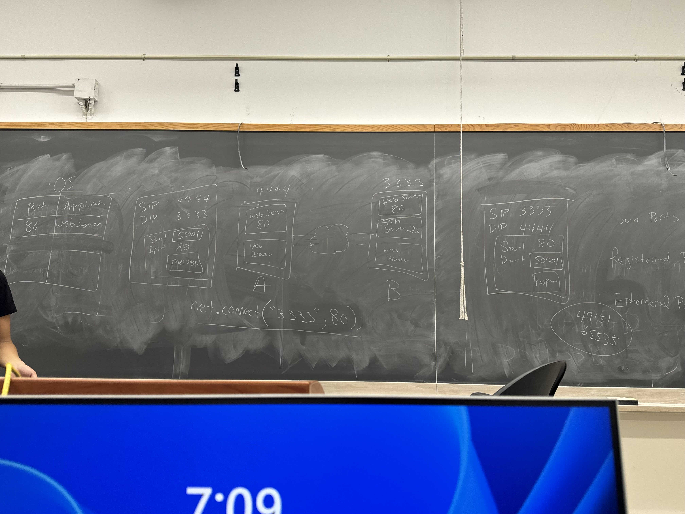
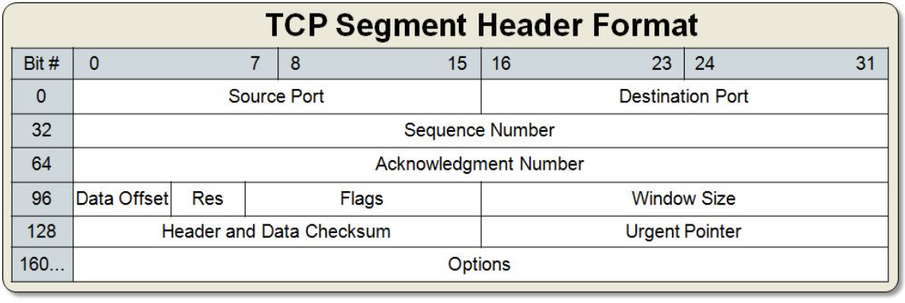
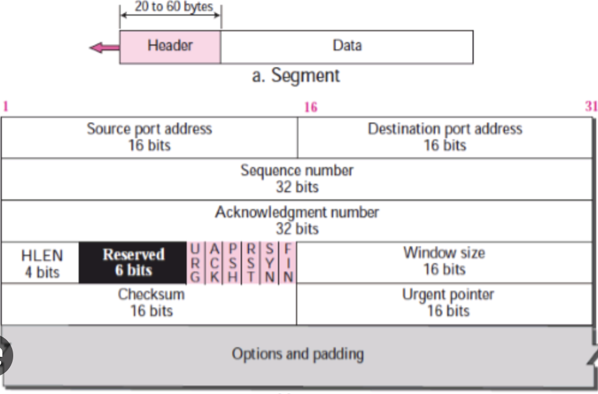

# Transport Layer
Provides delivery of messages to the correct application
- ensure that our messages are delivered to the correct applications

Two major protocols:
1. Transmission Control Protocol (TCP) + Reliable delievery, No OOOrder, No Duplicates, Conjestion Control
    - Better protocol, but costs more (speed)
2. User Datagram Protocol (UDP)
    - No guarantees

# UDP
UDP Header
- 32 bits
- Split 0 -> 15 | 16 -> 31

        Source  |  Destination
        Port    |  Port
        ---------------------
        Length  |  Checksum
Logical Port
- 16 bit (2^16 different numbers) number that is tagged on messages by the O.S. to identify applications that lease the port number.

Port Numbers
- 3 Ranges that we care about
    - 0 -> 1023: Well known ports
        - typically reserved by the operating system
        - makes it convenient for client applications
        - Examples:
            - Port 80: HTTP
            - Port 443: HTTPS
            - Port 22: SSH
            - Port 21: FTP
    - 1024 -> 49151: Registered ports
    - 49152 -> 65535: Ephemeral Ports
        - reserved for client application so that they can receive responses
        

Network Address Translation (Nat)
- A beautiful hack solution to the IPv4 Exhaustion problem
- Combines two things:
    1. Local IP Addresses (192.168.0.0 range)
    2. Port numbers

Difference with NAT Router:
- Each device gets a public IP Address, and a local IP Address

NAT Table
- 3 columns
    - Local IP
    - Old Port #
    - New Port #

# TCP
TCP Guarantees:
- Reliable delivery
- No duplicated messages (AABC -> AABBC)
- No out of orderness (ABC -> CAB)
- Congestion control

- Sequence Number:
    - Used to order number of data bytes sent over
- Acknowledgement Number:
    - Number of bytes successfully received in the correct order
- SYN
    - Used to open a TCP connection
- ACK
    - Signals the message is an acknowledgement
- FIN
    - Used to close a connection
- RST (RESET)
    - Something has gone wrong, restart connection
- Window Size
    - How many messages I can send out before I must wait for an acknowledgement

## Scenario 1
Alice and Bob are communicating over TCP. Alice initiates the connection.
Upon connecting, Alice sends three data segments: 100 Bytes(B), 200 B, 300 B.
All segments are received w/o error or delay. Upon receiving
all messages, Bob responds with two segments: 400 B, 500 B (No
Data is lost/delayed). **Bob closes the connection**

next_seq# = prev_seq# + prev_data_len

all SEQ/ACK intialized to 1 upon 3 way opening handshake

